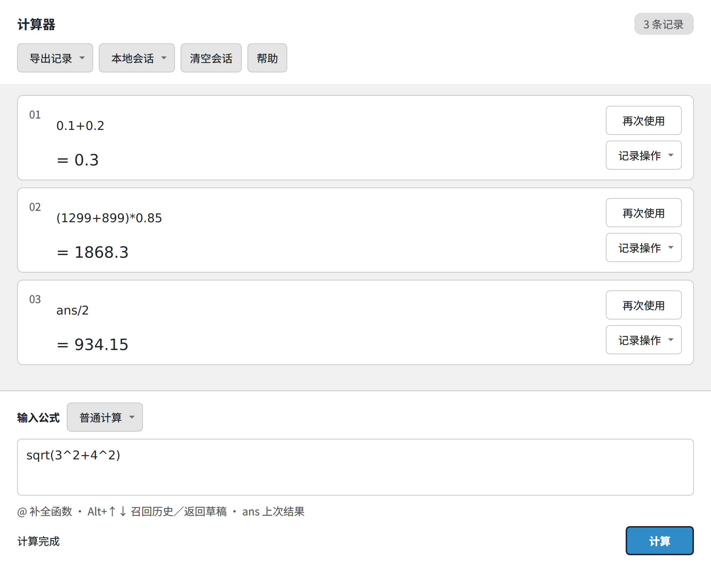

# CalcTabdd

**在 notepad-- 里边写边算，让公式与结果一起留在标签页中。**

CalcTabdd 是一个使用 C++14 / Qt 5.15 开发的开源计算器插件。它将每次计算按“公式在上、结果在下”排列，支持十进制计算、自定义公式、历史复用和本地会话，适合日常计算与重复代入。名称中的 `dd` 表示 `--`。

[下载安装](https://github.com/jiy29104983/CalcTabdd/releases) · [快速上手](#快速上手) · [详细使用说明](packaging/README.zh-CN.md) · [v1.0.0 更新说明](docs/releases/v1.0.0.md) · [版本记录](docs/releases/) · [问题反馈](https://github.com/jiy29104983/CalcTabdd/issues)

## 界面预览



*普通计算（浅色主题）：在同一页查看公式和结果，用 `ans` 接着计算。*

文中截图来自当前版本的真实 Qt 页面（Linux / Qt 5.15），仅展示计算器区域；Windows 宿主中的字体和控件细节可能不同。

## 主要功能

- **连续计算记录**：公式与结果上下分行，支持复制数值、复制整条计算和插入历史结果。
- **十进制与科学计算**：支持最多 50 位十进制有效数字，提供四则运算、乘方、取余及 14 个常用函数；舍入和近似计算会附来源说明。
- **自定义公式**：定义一次公式，逐行填写参数，修改数值后再次计算，适合重复代入。
- **快捷输入**：`@` 按英文名称或中文关键词补全函数与常量，`Alt+↑ / Alt+↓` 浏览历史并保留草稿。
- **记录导出与会话保存**：导出 TXT / Markdown，也可选择本地文件保存记录、参数和草稿，之后恢复继续计算。
- **融入编辑器**：每个宿主窗口拥有独立计算器，界面跟随明暗配色；普通模式支持错误位置标记，内置可搜索帮助。

## 安装

首个正式版本为 **1.0.0**，预编译包面向 **Windows x64**。

1. 在 [Releases](https://github.com/jiy29104983/CalcTabdd/releases) 下载 Windows x64 ZIP 安装包。
2. 退出所有 notepad-- 窗口，将包内 `plugin/calctabdd.dll` 放入 notepad-- 安装目录的 `plugin` 文件夹。
3. 重启 notepad--，选择 **插件 → CalcTabdd 计算器 → 打开计算器**。

目标运行库为 **Qt 5.15.2 / MSVC v142**，请使用匹配的宿主架构和运行库，不要覆盖宿主的 Qt DLL。不同宿主版本的使用情况可参照[使用检查清单](packaging/TESTING.zh-CN.md)确认。

升级时退出宿主并替换 DLL；卸载时退出宿主并删除 `plugin/calctabdd.dll`。自行保存的会话文件会保留。

## 快速上手

### 普通计算

在底部输入公式，按 **Ctrl+Enter** 或点击 **计算**。普通 Enter 只换行，编辑过程中不会自动计算。

| 输入 | 结果 | 用途 |
| --- | --- | --- |
| `(128+256)/3` | `128` | 四则运算 |
| `0.1+0.2` | `0.3` | 十进制小数 |
| `(1299+899)*0.85` | `1868.3` | 折扣计算 |
| `sqrt(3^2+4^2)` | `5` | 函数与乘方 |
| `6*7`，再输入 `ans+1` | `42`，然后 `43` | 使用上一次成功结果 |

每条记录的 **再次使用 / 修改公式** 按钮可将公式放回输入区，**记录操作** 菜单可复制或插入结果。重新提交会追加记录；含 `ans` 的公式使用当前会话的上次成功结果。计算失败时保留输入和先前的 `ans`，修正后即可重试。

### 自定义公式

例如，定义一个用于反复计算长方形面积的公式：

1. 在底部模式菜单选择 **自定义公式模式**。
2. 在公式定义栏输入 `S=w*h`，按 **Enter** 应用。
3. 在生成的参数区逐行填写：

   ```text
   w=12.5
   h=8
   ```

4. 按 **Ctrl+Enter**，历史中会显示 `S=12.5*8` 和 `= 100`。修改参数后再次提交即可进行下一次计算。


*自定义公式（深色主题）：保留公式与参数，修改数值后继续计算。*

普通模式与自定义模式分别保留草稿，共享 `ans`。修改公式仍在定义栏完成：Enter 应用，Esc 还原。参数每行一个，只接受数字、小数或科学计数法；定义中的函数与常量可用 `@` 补全。

### 常用快捷键

| 按键 | 操作 |
| --- | --- |
| `Ctrl+Enter` | 提交计算 |
| `Enter` | 普通公式与参数区换行；公式定义栏应用定义 |
| `@` | 在普通公式或公式定义栏查找函数、常量，如 `@平方根` |
| `↑ / ↓`、`Enter / Tab`、`Esc` | 补全列表中选择、插入、关闭候选 |
| `Alt+↑ / Alt+↓` | 向前 / 向后浏览历史，越过最新记录返回草稿 |

补全列表打开时，Enter 先插入候选；在定义栏中再按一次 Enter 才会应用定义。输入法组词期间优先处理输入法候选。

## 支持的运算

| 类别 | 运算符、函数或常量 |
| --- | --- |
| 基本运算 | `+`、`-`、`*`、`/`、`%`（取余）、`^`（乘方）、括号 |
| 基础函数 | `sqrt`、`abs`、`pow` |
| 三角函数 | `sin`、`cos`、`tan`（参数使用弧度） |
| 对数与指数 | `ln`（自然对数）、`log`（以 10 为底）、`exp` |
| 取整与比较 | `floor`、`ceil`、`round`、`min`、`max` |
| 常量与连续计算 | `pi`、`e`、`ans` |

支持 `.5`、`1.`、`1e3` 等数字写法，函数与常量不区分大小写。乘法须显式写为 `2*pi` 或 `2*(3+4)`；`%` 表示取余，不是百分比。`^` 从右向左结合，且优先于一元负号：`-2^2 = -4`，`(-2)^2 = 4`。

### 精度说明

- 十进制数最多支持 **50 位有效数字**，非零科学计数指数范围为 **-999 至 999**。十进制加、减、乘、取余在支持范围内精确计算，中间结果超限会报错。
- 每次十进制除法最多保留 50 位有效数字，取最近值，恰好居中时取偶数。例如 `1/8 = 0.125` 保持精确，`1/3` 会标明“含除法舍入”。
- `pi`、`e`、三角 / 对数 / 指数函数、非整数幂和不能精确开方的平方根使用近似计算。近似结果最多显示 17 位有效数字，**不代表 17 位都准确**。
- 使用 `ans` 或恢复会话可保留结果的类型与计算来源。复制或插入纯数值后再次提交，按新输入的十进制数字处理。

当前不支持任意精度、复数或符号求解。完整规则与示例见插件内的 **帮助 → 精度与限制**。

## 保存与导出

| 需要做什么 | 入口 | 保存内容 |
| --- | --- | --- |
| 留存或分享计算过程 | **导出记录 → 导出为 TXT / Markdown** | 已提交的公式、结果、错误和计算来源 |
| 下次继续计算 | **本地会话 → 开启保存／另存新文件…** | 记录、`ans`、两种模式的草稿、已确认公式及参数 |
| 继续已保存的会话 | 在空白计算器选择 **本地会话 → 恢复会话…** | 从 `.calctabdd` 文件恢复，不重新计算历史 |

**本地保存默认关闭**，关闭标签后如需继续，请先开启保存。同一个会话文件同时只能由一个窗口使用；当前仅支持第 3 版会话格式，不兼容旧格式。TXT / Markdown 供阅读，不能用于恢复会话。

清空会话会删除记录并重置 `ans`，不可撤销；已开启保存时也会更新会话文件。保存失败时，请在关闭标签前重试或另存。更多操作细节见[详细使用说明](packaging/README.zh-CN.md)。

## 开发与构建

依赖 **C++14 编译器、CMake 3.16+、Qt 5.15 开发包**；运行自动化测试还需要 Qt Test。

```bash
git clone https://github.com/jiy29104983/CalcTabdd.git
cd CalcTabdd
cmake -S . -B build/local -DCMAKE_BUILD_TYPE=Release -DBUILD_TESTING=ON
cmake --build build/local --config Release --parallel 4
ctest --test-dir build/local -C Release --output-on-failure --no-tests=error
```

若 CMake 无法找到 Qt，在配置命令中添加 `-DCMAKE_PREFIX_PATH=/path/to/Qt`。以上流程启用引擎和页面测试；宿主集成测试还需设置 `CALCTABDD_HOST_SOURCE_DIR`，指向 [notepad-- 源码](https://github.com/cxasm/notepad--)。宿主依赖的固定版本和 Windows x64 / MSVC v142 构建配置见 [Windows 工作流](.github/workflows/windows.yml)。本地页面测试不能替代 Windows 宿主中的插件加载与交互验证。

| 目录 | 内容 |
| --- | --- |
| `src/` | 计算引擎、Qt 页面与宿主插件接口 |
| `tests/` | 引擎、页面和插件集成测试 |
| `packaging/` | 安装说明与使用检查清单 |
| `scripts/` | Windows 打包与包校验工具 |
| `docs/releases/` | 各版本变更说明 |

## 反馈与贡献

欢迎通过 [Issues](https://github.com/jiy29104983/CalcTabdd/issues) 报告问题或提出建议，通过 [Pull Requests](https://github.com/jiy29104983/CalcTabdd/pulls) 提交改进。

报告问题时，请提供 notepad-- 与 CalcTabdd 版本、操作系统、复现步骤，以及预期和实际结果；界面问题可附截图，计算问题请附可直接输入的公式。提交代码前请运行相关测试，涉及使用方式的修改请同步更新帮助与文档。

## 许可证

本项目采用 **GNU GPL v3.0 or later**，详见 [LICENSE](LICENSE)。
